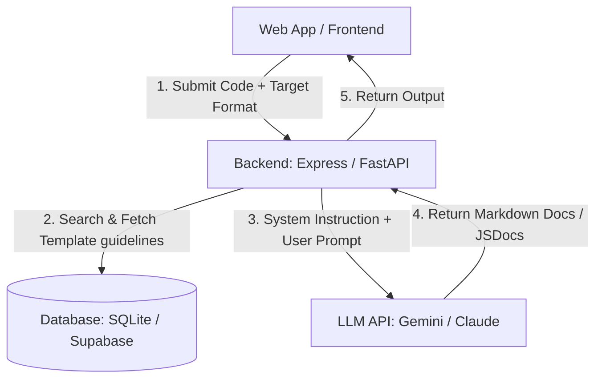

# Blueprints: Auto Documentation Generator

This is a premium, ready-to-code frontend template for an **Auto Documentation Generator**. The interface is pre-built with CSS styling and interactive JS simulations, so you can focus on writing the AI agent logic and database storage.

## Recommended Architecture



---

## 🛠️ Step-by-Step Implementation Guide

Follow these steps using Antigravity / Claude Code to build out the backend:

### 1. Initialize Server & Dependencies
Initialize a Node.js or Python backend. For example, using Python & FastAPI:
```bash
pip install fastapi uvicorn google-genai
```

### 2. Craft the Prompt Templates
Depending on the requested format, select the appropriate system instruction:
- **README.md**: "You are an technical writer. Analyze the code and generate a comprehensive user manual, installation guide, and setup instructions in clean Markdown format."
- **API Reference**: "You are an API designer. Output a structured API specification table showing each function, its parameters, return types, exceptions, and descriptions."
- **Inline Comments**: "You are a code refactoring tool. Take the input code and output it exactly, but insert standard JSDoc / Docstring headers before each class, interface, and method. Do not omit any code lines."

### 3. Connect the LLM API
Create a `/api/generate-docs` endpoint that runs the model:
```python
from google import genai
from google.genai import types

client = genai.Client()

@app.post("/api/generate-docs")
async def generate_docs(code: str, doc_format: str):
    # Select instruction based on doc_format
    if doc_format == "readme":
        instruction = "Generate a comprehensive README.md with headings, dependencies, code examples, and api references."
    elif doc_format == "api":
        instruction = "Generate a standard tabular API reference guide mapping signatures, arguments, and return models."
    else:
        instruction = "Inject clean JSDoc/docstrings directly into the provided code script. Keep all original code lines."

    response = client.models.generate_content(
        model='gemini-2.5-flash',
        contents=f"Document this code module:\n{code}",
        config=types.GenerateContentConfig(
            system_instruction=instruction
        ),
    )
    return {"documentation": response.text}
```

---

## 🚀 How to Run locally
Simply open `index.html` in your browser, or spin up a local development server:
```bash
npx live-server .
```
